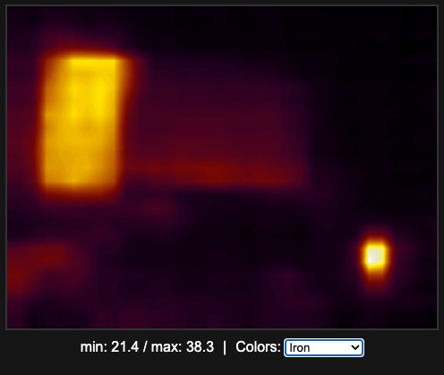

# Thermal Camera based on ESP32 and MLX90640

Simple ESP32 thermal camera project. 

Uses ESP32 with Wifi and `GY-MLX90640` or similar thermal camera working on `I2C` and based on`MLX90640`. After minor modifications it should support Serial (UART) communication since `Adafruit MLX90640` driver supports it.

It serves WiFi Access Point, and serves simple web interface where you can see video stream from the camera eg. on your mobile phone.

Resolution and refresh rate are low due to `MLX90640` limitations, although used interpolation improves image quality and it's enough for simple use cases like checking heat leaks at home.

It utilizes websockets for communication, and in case of failure it pulls data via `GET` requests from `/data` endpoint as a fallback.

# Current features

- 4Hz refresh rate, aorund 4 frames per second
- Web interface with video stream and basic options
- It shows min and max temperatures registered on the screen
- Basic color palettes to choose, based on popular ones found in some industry cameras like: Rainbow, White Hot, Fusion-like, etc.

# Modules/libs used

- Adafruit_MLX90640 for thermal camera control
- WiFi for AP setup
- ESPAsyncWebServer for websocket and server communication
- ArduinoJson for json data handling

# Setup & Development

- Add `src/secrets.h` file with your WiFi credentials
- Bu default Web interface is served on `192.168.4.1` when connected to ESP32 AP. You can change this in `src/main.cpp`
- Web client with dummy data server can be found in `./web-client` folder
- After modifying client in `./web-client/index.html`, it's required to move it's code and html (full or minimized) into `main.cpp` to be served. There's build taks which will minimize it for production
- Compile for ESP32 Dev Kit board, even if other ESP32 with WiFi is being used for final device